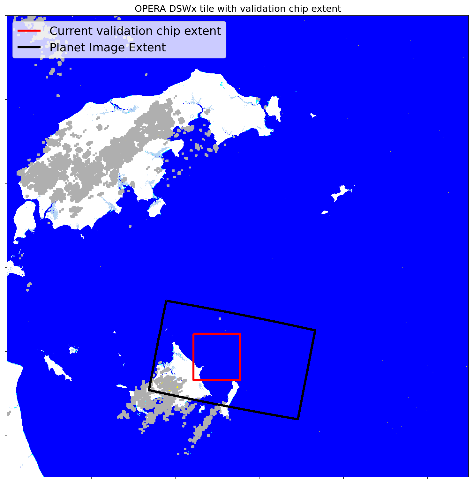
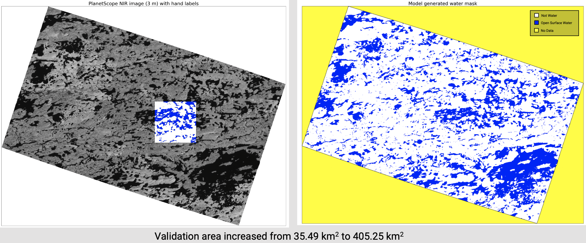
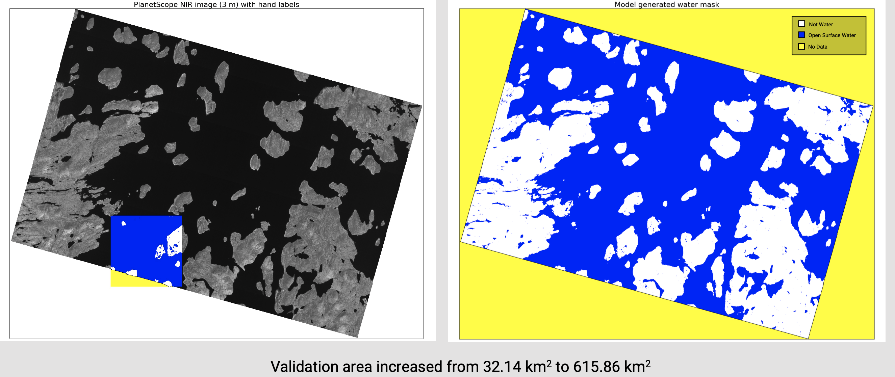

In this repository, we train models that help us expand the amount of data available for OPERA DSWx validation. We leverage the expert-generated validation data produced for the OPERA DSWx-HLS product, and produce open surface water / not water inferences on full Planetscope images.

For example, the figure below shows an OPERA DSWx tile, along with the extent of a PlanetScope image used for validation, and the extent of the hand labeled data over which validation occurs:
<p align="center">

</p>
Ideally we would like to use the entire PlanetScope image for DSWx validation.

<br/>
Here are two examples of the water masks expanded to span the PlanetScope image, generated using the models trained on the existing validation data.
<p align="center">

</p>

<p align="center">

</p>

Once the expanded validation data is generated, we can follow a previously established workflow ([see here](https://github.com/OPERA-Cal-Val/DSWx-HLS-Requirement-Verification/blob/05ac35701d506ce6d1a1e886fc6c1198003e7eff/0-Verify_Requirements.ipynb)) to compare the DSWx product to the generated classification, and assign a pass/fail score based on requirements.

# Repository layout
The layout of the repository is shown below:

    .
    ├── data
    │   └─ validation_table.csv   # File describing Planet, HLS, and DSWx image IDs, along with S3 bucket links to the DSWx and validation data
    ├── latex # summary reports can be generated using these latex files
    │   ├─ main.tex 
    │   └─ summary.tex
    ├── notebooks
    │   ├─ .env         # Location for Planet API key
    │   ├─ 0-Setup-folder-structures.ipynb
    │   ├─ 1a-Download-datasets.ipynb
    │   ├─ 2a-Train-and-infer-all-chips.ipynb
    │   ├─ 2b-Train-and-infer-single-RF.ipynb
    │   ├─ 2c-Train-boosted-trees.ipynb
    │   ├─ 2d-new-inferences.ipynb
    │   ├─ 3a-Recalculate-validation-metrics.ipynb
    │   ├─ 3b-Recalculate-validation-metrics-all-images.ipynb
    │   ├─ rf_funcs.py
    │   └─ tools.py
    │
    ├── environment.yml # YAML file describing environment dependencies
    ├── LICENSE.txt     # Apache license 2.0
    └── README.md       # This file

This layout will change as datasets are downloaded and model inferences are generated. Planetscope images are downloaded into scenewise folders within `data/`, along with the corresponding DSWx data. Cropped versions of the Planetscope images are also saved in scenewise folders, into the `data/planet_images_cropped` along with the expert-drawn classification data.

# Environment setup
The included environment file can be used to create an Anaconda environment with the requisite python packages to run the codes in this repository. We recommend using [`mamba`](https://mamba.readthedocs.io/en/latest/installation.html) to speed up this process. The environment is created and activated by the following commands from the root directory of the repository:

```
mamba env create -f environment.yml
...
mamba activate expand-validation
```
# Downloading the DSWx-HLS CalVal database
Running the notebooks in this repository requires users to download the DSWx-HLS CalVal database from NASA Earthdata. The DSWx tiles and validation data needed to run the notebooks in this repository require NASA Earthdata login credentials: [see this link to register for an account](https://urs.earthdata.nasa.gov/).

Once registered, download the OPERA DSWx-HLS CalVal data base by clicking [on this link](https://search.earthdata.nasa.gov/search/granules?p=C2603501575-POCLOUD&pg[0][v]=f&pg[0][gsk]=-start_date&q=%22OPERA%22&tl=1699895478!3!!) or by visiting https://search.earthdata.nasa.gov/search/ and searching for `OPERA CalVal database`. The first returned result will include the link to a zipped archive (`DB.zip`) which must be unzipped into the `data` folder.

# Downloading PlanetScope images
Training models requires the original 3 m PlanetScope imagery from which hand labels were generated. Access to Planet data requires an API key, which needs to be specified in the `.env` file within the `notebooks` folder. The content of the file is a line specifying the API key:
```
PLANET_API_KEY='YOUR KEY HERE'
```
Planet data is made available through the NASA Commercial Smallsat Data Acquisition (CSDA) program. The access request form is available through the [CSDA website](https://www.earthdata.nasa.gov/esds/csda). Once filled out, users should receive to an account with an API key.

# Executing Jupyter Notebooks
The notebooks contained in this repository are numbered, and they should be executed in order to work correctly. For example, `notebooks/2a-Train-and-infer-all-chips.ipynb` will require that `notebooks/1a-Download-datasets.ipynb` is executed first.

# Troubleshooting
If DSWx tiles corresponding to the Planet images do not get downloaded into the respective folders, it is likely because of updated DSWx filenames. Replace the `data/validation_table.csv` file with the one from [this link](https://github.com/OPERA-Cal-Val/DSWx-Requirement-Verification/blob/dev/dswx_verification/data/validation_table.csv)